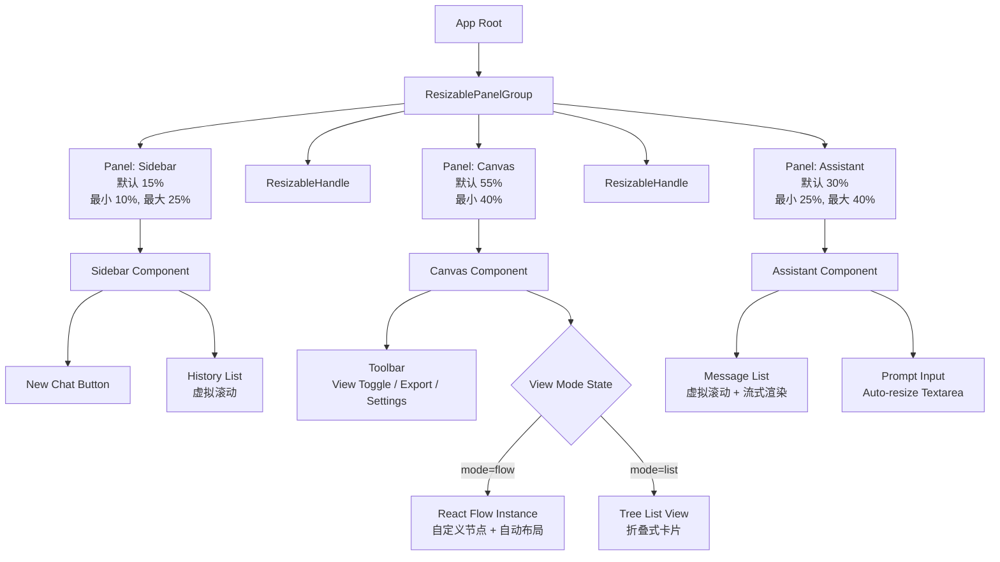
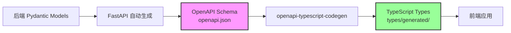
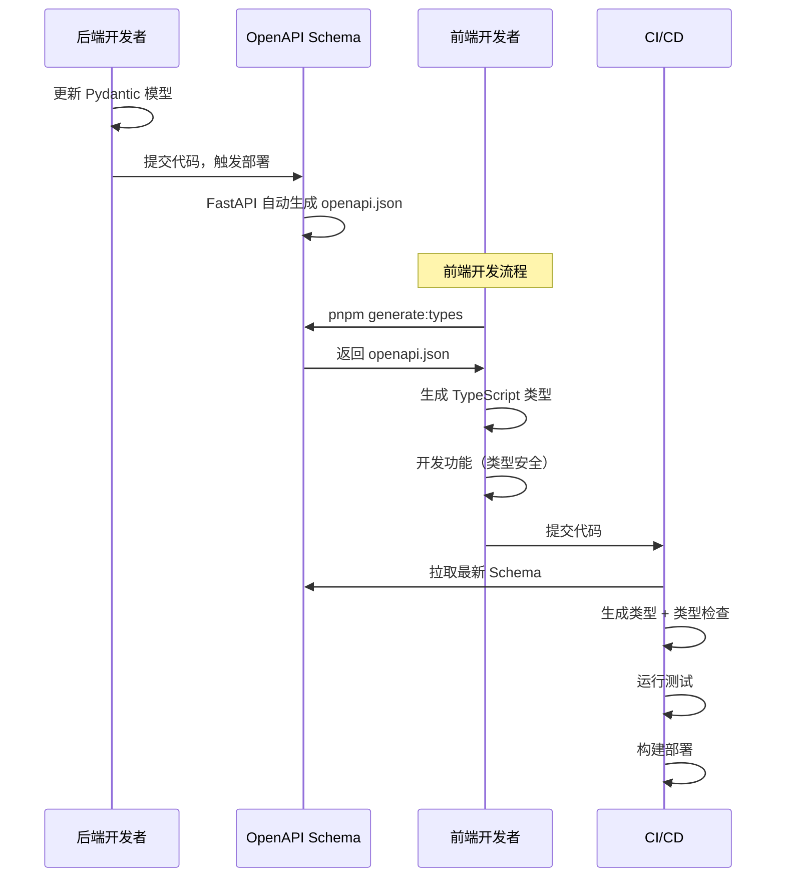

# 个性化学习路线图系统 - 前端开发规范

## 1. 项目概述

### 1.1 核心目标

为学习路线图生成系统提供现代化、交互式的 Web 前端，实现：
- **实时流式对话**：类 ChatGPT 的 AI 助手交互体验
- **可视化路线图**：支持流程图（Flow）和列表（List）两种展示模式
- **响应式布局**：可拖拽调整的三栏布局（Sidebar + Canvas + Assistant）
- **无缝衔接后端**：与 SD-MAS 架构的 Agent 系统深度集成

### 1.2 设计原则

| 原则 | 说明 |
|:---|:---|
| **类型安全优先** | TypeScript 覆盖率 100%，与后端 Pydantic 模型端到端对齐 |
| **组件化开发** | 使用 Shadcn/ui 源码级组件，避免重复造轮子 |
| **性能至上** | SSR + 懒加载 + 虚拟滚动，确保大型路线图流畅渲染 |
| **渐进增强** | 基础功能降级方案（SSE 失败回退到轮询） |
| **无障碍访问** | WCAG 2.1 AA 级别合规（键盘导航、语义化 HTML） |

---

## 2. 技术栈选型 (Tech Stack)

| 领域 | 技术选型 | 版本要求 | 理由 |
|:---|:---|:---|:---|
| **框架** | **Next.js (App Router)** | ^14.0.0 | React 生态标准。SSR 支持 SEO，App Router 提供优秀的路由管理和流式渲染能力 |
| **语言** | **TypeScript** | ^5.3.0 | 必须。与后端的 Pydantic 模型（JSON Schema）进行端到端类型对齐 |
| **UI 组件库** | **Shadcn/ui** + **Tailwind CSS** | latest | **关键选型**。极简黑白灰风格，高度可定制，源码级引入，Tree-shaking 友好 |
| **状态管理** | **Zustand** | ^4.4.0 | 轻量级。管理聊天消息、路线图数据的跨组件同步，比 Redux 简单 |
| **流程图引擎** | **React Flow** | ^11.10.0 | **核心**。实现路线图的流程图模式。支持自定义节点、自动布局、缩放拖拽 |
| **列表渲染** | **React Markdown** | ^9.0.0 | 渲染列表模式和 AI 输出的 Markdown 内容 |
| **布局管理** | **react-resizable-panels** | ^1.0.0 | 实现可拖拽调整宽度的分栏布局（类 IDE/Notion 体验） |
| **数据获取** | **TanStack Query** | ^5.0.0 | 处理 REST API 请求（历史记录、用户配置），内置缓存和重试 |
| **流式通信** | **EventSource (Native SSE)** | - | 自定义 Hook 处理后端的 Server-Sent Events |
| **图标库** | **Lucide React** | ^0.300.0 | Shadcn/ui 标配。极简线条风格，Tree Shaking 友好 |
| **全局提示** | **Sonner** | ^1.3.0 | 颜值最高的 Toast 库。堆叠式通知，动画丝滑 |
| **表单与校验** | **React Hook Form** + **Zod** | ^7.48.0 / ^3.22.0 | 处理提示词输入、配置表单。Zod 复用后端 Schema 逻辑 |
| **动画交互** | **Framer Motion** | ^10.16.0 | 实现高级感。Sidebar 展开、视图切换、消息淡入等过渡效果 |
| **时间处理** | **date-fns** | ^3.0.0 | 处理聊天时间戳、路线图截止日期。比 Moment.js 轻量 |
| **CSS 工具** | **clsx** + **tailwind-merge** | ^2.0.0 / ^2.1.0 | 动态拼接 Class，解决 Tailwind 样式冲突 |
| **Markdown 增强** | **remark-gfm** + **rehype-highlight** | ^4.0.0 / ^7.0.0 | 支持 GFM 表格、代码高亮 |

---

## 3. 项目结构 (Project Structure)

```text
/learning-roadmap-frontend
├── /app                                # Next.js 14 App Router
│   ├── layout.tsx                      # 全局布局（Provider 注入）
│   ├── page.tsx                        # 首页 (/)
│   ├── /roadmap
│   │   └── [id]
│   │       └── page.tsx                # 路线图详情页 (/roadmap/:id)
│   ├── /api                            # API 路由（可选，用于 BFF 层）
│   │   ├── /chat
│   │   │   └── route.ts                # SSE 代理端点
│   │   └── /export
│   │       └── route.ts                # 路线图导出（PDF/JSON）
│   └── globals.css                     # Tailwind 基础样式 + CSS Variables
│
├── /components                         # 组件库
│   ├── /ui                             # Shadcn/ui 组件（自动生成）
│   │   ├── button.tsx
│   │   ├── dialog.tsx
│   │   ├── input.tsx
│   │   └── ...
│   │
│   ├── /layout                         # 布局组件
│   │   ├── AppShell.tsx                # 主应用壳（三栏布局容器）
│   │   ├── Sidebar.tsx                 # 左侧历史记录栏
│   │   ├── Canvas.tsx                  # 中间画布区（路线图展示）
│   │   └── Assistant.tsx               # 右侧 AI 助手
│   │
│   ├── /roadmap                        # 路线图核心组件
│   │   ├── /flow                       # 流程图模式
│   │   │   ├── FlowCanvas.tsx          # React Flow 容器
│   │   │   ├── StageNode.tsx           # Stage 节点（自定义）
│   │   │   ├── ModuleNode.tsx          # Module 节点
│   │   │   ├── ConceptNode.tsx         # Concept 节点
│   │   │   └── AutoLayout.ts           # Dagre 自动布局算法
│   │   │
│   │   ├── /list                       # 列表模式
│   │   │   ├── ListView.tsx            # 列表视图容器
│   │   │   ├── StageCard.tsx           # Stage 卡片
│   │   │   ├── ModuleCard.tsx          # Module 卡片
│   │   │   └── ConceptCard.tsx         # Concept 卡片
│   │   │
│   │   ├── ViewToggle.tsx              # Flow/List 切换按钮
│   │   └── ProgressBar.tsx             # 学习进度条
│   │
│   ├── /chat                           # 聊天交互组件
│   │   ├── MessageList.tsx             # 消息列表（支持虚拟滚动）
│   │   ├── MessageItem.tsx             # 单条消息
│   │   ├── TypingIndicator.tsx         # AI 思考中动画
│   │   ├── StreamRenderer.tsx          # 流式文本渲染器
│   │   └── PromptInput.tsx             # 提示词输入框（auto-resize）
│   │
│   ├── /tutorial                       # 教程内容组件
│   │   ├── TutorialDialog.tsx          # 教程弹窗（点击 Concept 后打开）
│   │   ├── TutorialSection.tsx         # 教程章节
│   │   ├── CodeBlock.tsx               # 代码块（支持语法高亮）
│   │   └── ExerciseCard.tsx            # 练习题卡片
│   │
│   └── /common                         # 通用组件
│       ├── LoadingSpinner.tsx
│       ├── ErrorBoundary.tsx
│       ├── EmptyState.tsx
│       └── ConfirmDialog.tsx
│
├── /lib                                # 核心工具库
│   ├── /api                            # API 客户端
│   │   ├── client.ts                   # Axios 实例配置
│   │   ├── endpoints.ts                # API 端点定义
│   │   ├── sse.ts                      # SSE 连接管理器
│   │   └── types.ts                    # API 请求/响应类型
│   │
│   ├── /store                          # Zustand 状态管理
│   │   ├── useRoadmapStore.ts          # 路线图状态
│   │   ├── useChatStore.ts             # 聊天状态
│   │   ├── useUIStore.ts               # UI 状态（Sidebar 展开、视图模式）
│   │   └── useUserStore.ts             # 用户偏好配置
│   │
│   ├── /hooks                          # 自定义 Hooks
│   │   ├── useSSE.ts                   # SSE 流式连接
│   │   ├── useDebounce.ts              # 防抖
│   │   ├── useLocalStorage.ts          # 本地存储
│   │   └── useKeyboardShortcut.ts      # 键盘快捷键
│   │
│   ├── /utils                          # 工具函数
│   │   ├── cn.ts                       # clsx + tailwind-merge 封装
│   │   ├── formatters.ts               # 时间、文本格式化
│   │   ├── validators.ts               # 表单校验规则
│   │   └── exporters.ts                # 导出功能（JSON/Markdown/PDF）
│   │
│   └── /constants                      # 常量定义
│       ├── routes.ts                   # 路由常量
│       ├── colors.ts                   # 主题颜色
│       └── config.ts                   # 全局配置
│
├── /types                              # TypeScript 类型定义
│   ├── /generated                      # 🤖 自动生成（不要手动修改）
│   │   ├── index.ts                    # 统一导出
│   │   ├── /models                     # 数据模型（来自后端 Pydantic）
│   │   │   ├── LearningPreferences.ts
│   │   │   ├── UserRequest.ts
│   │   │   ├── Concept.ts
│   │   │   ├── Module.ts
│   │   │   ├── Stage.ts
│   │   │   ├── RoadmapFramework.ts
│   │   │   └── ...
│   │   ├── /services                   # API Service 函数
│   │   │   ├── RoadmapService.ts
│   │   │   ├── TutorialService.ts
│   │   │   └── ...
│   │   └── /core                       # 核心工具
│   │       ├── ApiError.ts
│   │       └── request.ts
│   │
│   └── /custom                         # ✍️ 手动维护（前端专用）
│       ├── ui.ts                       # UI 组件专用类型
│       ├── store.ts                    # Store 类型
│       ├── sse.ts                      # SSE 事件类型
│       └── utils.ts                    # 工具函数类型
│
├── /styles                             # 全局样式
│   └── themes                          # 主题配置（明暗模式）
│       ├── light.css
│       └── dark.css
│
├── /public                             # 静态资源
│   ├── /icons
│   └── /illustrations
│
├── /tests                              # 测试文件
│   ├── /unit                           # 单元测试
│   ├── /integration                    # 集成测试
│   └── /e2e                            # E2E 测试（Playwright）
│
├── /scripts                            # 🔧 构建脚本
│   ├── generate-types.ts               # 类型生成脚本
│   └── generate-types.config.ts        # 类型生成配置
│
├── tailwind.config.ts                  # Tailwind 配置
├── tsconfig.json                       # TypeScript 配置
├── next.config.js                      # Next.js 配置
├── package.json
├── .env.example                        # 环境变量示例
├── .gitignore                          # Git 忽略文件
└── README.md
```

---

## 4. 页面布局架构 (Layout Architecture)

### 4.1 布局结构

基于可拖拽调整的三栏布局，使用 `react-resizable-panels` 实现：



### 4.2 布局实现代码骨架

```tsx
// components/layout/AppShell.tsx
import { ResizablePanelGroup, ResizablePanel, ResizableHandle } from '@/components/ui/resizable';
import { Sidebar } from './Sidebar';
import { Canvas } from './Canvas';
import { Assistant } from './Assistant';

export function AppShell() {
  return (
    <div className="h-screen w-screen bg-background">
      <ResizablePanelGroup direction="horizontal">
        {/* 左侧：历史记录 */}
        <ResizablePanel defaultSize={15} minSize={10} maxSize={25}>
          <Sidebar />
        </ResizablePanel>

        <ResizableHandle withHandle />

        {/* 中间：路线图画布 */}
        <ResizablePanel defaultSize={55} minSize={40}>
          <Canvas />
        </ResizablePanel>

        <ResizableHandle withHandle />

        {/* 右侧：AI 助手 */}
        <ResizablePanel defaultSize={30} minSize={25} maxSize={40}>
          <Assistant />
        </ResizablePanel>
      </ResizablePanelGroup>
    </div>
  );
}
```

---

## 5. 数据模型定义 (Type Definitions)

### 5.1 类型生成策略：前后端类型同步

为了确保前后端数据结构的一致性，我们使用 **OpenAPI 规范** 作为中间层，通过 `openapi-typescript-codegen` 自动生成 TypeScript 类型定义。

#### 5.1.1 技术方案



**核心优势**：
- ✅ **单一数据源**：后端 Pydantic 模型为唯一真实来源
- ✅ **自动同步**：通过脚本自动拉取和生成，避免手动维护
- ✅ **类型安全**：编译时发现数据不匹配问题
- ✅ **文档即代码**：OpenAPI Schema 同时作为 API 文档

#### 5.1.2 依赖安装

```bash
pnpm add -D openapi-typescript-codegen
```

#### 5.1.3 配置文件

```typescript
// scripts/generate-types.config.ts
import { generate } from 'openapi-typescript-codegen';

export const config = {
  // OpenAPI Schema 来源（后端提供的 API 端点）
  input: process.env.OPENAPI_SCHEMA_URL || 'http://localhost:8000/openapi.json',
  
  // 或者使用本地文件
  // input: './openapi.json',
  
  // 生成目标目录
  output: './types/generated',
  
  // 生成选项
  httpClient: 'fetch', // 使用原生 fetch
  useOptions: true,    // 生成带 options 参数的函数
  useUnionTypes: true, // 使用 Union Types 而非 Enum
  exportCore: true,    // 导出核心工具函数
  exportServices: true, // 生成 API Service 函数
  exportModels: true,   // 生成 Model 类型
  exportSchemas: false, // 不导出 JSON Schema
  
  // 命名规则
  postfixServices: 'Service',
  postfixModels: '',
  
  // 请求配置
  request: './lib/api/request.ts', // 自定义请求函数
};
```

#### 5.1.4 类型生成脚本

```typescript
// scripts/generate-types.ts
import { generate } from 'openapi-typescript-codegen';
import { config } from './generate-types.config';
import fs from 'fs';
import path from 'path';

async function generateTypes() {
  console.log('🔄 开始生成 TypeScript 类型...');
  console.log(`📥 从以下地址拉取 OpenAPI Schema: ${config.input}`);

  try {
    // 生成类型
    await generate(config);
    
    console.log('✅ TypeScript 类型生成成功！');
    console.log(`📁 输出目录: ${config.output}`);
    
    // 生成索引文件，方便导入
    generateIndexFile();
    
  } catch (error) {
    console.error('❌ 类型生成失败:', error);
    process.exit(1);
  }
}

function generateIndexFile() {
  const indexContent = `/**
 * 自动生成的类型定义
 * 
 * 生成时间: ${new Date().toISOString()}
 * 来源: ${config.input}
 * 
 * ⚠️ 警告：请勿手动修改此文件
 * 运行 \`pnpm generate:types\` 重新生成
 */

export * from './models';
export * from './services';
export type { ApiError, ApiRequestOptions, ApiResult } from './core/ApiError';
`;

  fs.writeFileSync(
    path.join(config.output, 'index.ts'),
    indexContent,
    'utf-8'
  );
  
  console.log('📝 已生成索引文件: types/generated/index.ts');
}

generateTypes();
```

#### 5.1.5 自定义请求函数（适配 Axios）

```typescript
// lib/api/request.ts
import type { ApiRequestOptions } from '@/types/generated/core/ApiError';
import { apiClient } from './client';

/**
 * 自定义请求函数，供 openapi-typescript-codegen 生成的代码使用
 */
export async function request<T>(options: ApiRequestOptions): Promise<T> {
  const { method, url, headers, body, query } = options;

  try {
    const response = await apiClient.request<T>({
      method: method as any,
      url,
      headers,
      data: body,
      params: query,
    });

    return response.data;
  } catch (error: any) {
    // 统一错误处理
    throw {
      status: error.response?.status || 500,
      statusText: error.response?.statusText || 'Unknown Error',
      body: error.response?.data,
      url,
    };
  }
}
```

#### 5.1.6 Package.json 脚本配置

```json
{
  "scripts": {
    "generate:types": "tsx scripts/generate-types.ts",
    "generate:types:watch": "nodemon --watch ../backend --ext py --exec pnpm generate:types",
    "prebuild": "pnpm generate:types",
    "dev": "pnpm generate:types && next dev",
    "type-check": "tsc --noEmit"
  },
  "devDependencies": {
    "openapi-typescript-codegen": "^0.27.0",
    "tsx": "^4.7.0",
    "nodemon": "^3.0.2"
  }
}
```

#### 5.1.7 生成的类型结构示例

```text
/types
├── /generated                    # 自动生成（不要手动修改）
│   ├── index.ts                  # 统一导出
│   ├── /models                   # 数据模型
│   │   ├── LearningPreferences.ts
│   │   ├── UserRequest.ts
│   │   ├── Concept.ts
│   │   ├── Module.ts
│   │   ├── Stage.ts
│   │   ├── RoadmapFramework.ts
│   │   ├── Tutorial.ts
│   │   └── ...
│   ├── /services                 # API Service 函数
│   │   ├── RoadmapService.ts     # 路线图相关 API
│   │   ├── TutorialService.ts    # 教程相关 API
│   │   └── ...
│   └── /core                     # 核心工具
│       ├── ApiError.ts
│       ├── ApiRequestOptions.ts
│       └── request.ts
│
└── /custom                       # 手动维护的类型
    ├── ui.ts                     # UI 组件专用类型
    ├── store.ts                  # Store 类型
    └── utils.ts                  # 工具函数类型
```

#### 5.1.8 使用生成的类型

```typescript
// ✅ 正确：使用自动生成的类型
import type { 
  RoadmapFramework, 
  Concept, 
  UserRequest 
} from '@/types/generated';
import { RoadmapService } from '@/types/generated';

// 使用类型
const roadmap: RoadmapFramework = await RoadmapService.getRoadmap({ id: '123' });

// 使用 Service 函数（自动生成，包含 API 端点）
const createRoadmap = async (request: UserRequest) => {
  const response = await RoadmapService.createRoadmap({ requestBody: request });
  return response;
};
```

```typescript
// ❌ 错误：手动定义与后端重复的类型
interface RoadmapFramework {  // 不要这样做！
  roadmap_id: string;
  // ...
}
```

#### 5.1.9 CI/CD 集成

```yaml
# .github/workflows/type-check.yml
name: Type Check

on: [push, pull_request]

jobs:
  type-check:
    runs-on: ubuntu-latest
    steps:
      - uses: actions/checkout@v4
      
      # 从后端 Artifact 下载 OpenAPI Schema
      - name: Download OpenAPI Schema
        run: |
          curl -o openapi.json http://backend-staging.example.com/openapi.json
      
      # 生成类型
      - name: Generate TypeScript Types
        run: pnpm generate:types
      
      # 运行类型检查
      - name: Type Check
        run: pnpm type-check
      
      # 提交生成的类型（可选）
      - name: Commit Generated Types
        if: github.ref == 'refs/heads/main'
        run: |
          git config user.name "github-actions"
          git config user.email "github-actions@github.com"
          git add types/generated
          git diff --quiet && git diff --staged --quiet || git commit -m "chore: update generated types [skip ci]"
          git push
```

#### 5.1.10 开发工作流

```bash
# 1. 后端开发者更新 Pydantic 模型
# backend/src/domain/models.py 修改

# 2. 后端启动（自动生成 OpenAPI Schema）
cd backend && uvicorn main:app --reload

# 3. 前端拉取最新类型（手动）
cd frontend && pnpm generate:types

# 4. 或者开启监听模式（自动）
pnpm generate:types:watch
# 检测到后端文件变化时自动重新生成

# 5. 开发前端功能（类型安全）
pnpm dev
```

#### 5.1.11 注意事项

| 场景 | 说明 | 解决方案 |
|:---|:---|:---|
| **后端 API 未启动** | 拉取不到 OpenAPI Schema | 使用本地缓存的 `openapi.json`，或跳过类型生成 |
| **类型冲突** | 前端需要扩展后端类型 | 使用 TypeScript 的 `&` 交叉类型或 `extends` 接口继承 |
| **命名不符合前端规范** | 后端使用 `snake_case` | 配置 `openapi-typescript-codegen` 的 `useOptions` 转换命名 |
| **类型过于严格** | 某些字段实际可选 | 使用 `Partial<T>` 或自定义 Utility Type |

#### 5.1.12 类型扩展示例

```typescript
// types/custom/roadmap.ts
import type { RoadmapFramework as BaseRoadmap } from '@/types/generated';

/**
 * 扩展后端类型，添加前端专用字段
 */
export interface RoadmapFrameworkWithUI extends BaseRoadmap {
  // 前端专用：是否已收藏
  isFavorite?: boolean;
  
  // 前端专用：本地缓存时间
  cachedAt?: number;
  
  // 前端专用：UI 展开状态
  expandedStages?: string[];
}

/**
 * 从后端类型转换为前端类型
 */
export function enrichRoadmap(
  base: BaseRoadmap, 
  ui: { isFavorite?: boolean }
): RoadmapFrameworkWithUI {
  return {
    ...base,
    isFavorite: ui.isFavorite ?? false,
    cachedAt: Date.now(),
    expandedStages: [],
  };
}
```

---

### 5.2 核心业务模型（自动生成）

以下类型由 `openapi-typescript-codegen` 自动生成，**无需手动维护**。

```typescript
// types/generated/models/LearningPreferences.ts
// ⚠️ 此文件由脚本自动生成，请勿手动修改

/**
 * 以下是生成的类型示例（实际由工具生成）
 */

export interface LearningPreferences {
  learning_goal: string;
  available_hours_per_week: number;
  motivation: string;
  current_level: 'beginner' | 'intermediate' | 'advanced';
  career_background: string;
  content_preference: Array<'video' | 'text' | 'interactive' | 'project'>;
  target_deadline?: string;
}

export interface UserRequest {
  user_id: string;
  session_id: string;
  preferences: LearningPreferences;
  additional_context?: string;
}

export interface Concept {
  concept_id: string;
  name: string;
  description: string;
  estimated_hours: number;
  prerequisites: Array<string>;
  difficulty: 'easy' | 'medium' | 'hard';
  keywords: Array<string>;
  content_status: 'pending' | 'generating' | 'completed' | 'failed';
  content_ref?: string;
  content_version: string;
  content_summary?: string;
}

export interface Module {
  module_id: string;
  name: string;
  description: string;
  concepts: Array<Concept>;
}

export interface Stage {
  stage_id: string;
  name: string;
  description: string;
  order: number;
  modules: Array<Module>;
}

export interface RoadmapFramework {
  roadmap_id: string;
  title: string;
  stages: Array<Stage>;
  total_estimated_hours: number;
  recommended_completion_weeks: number;
}

// 更多类型... (由 openapi-typescript-codegen 自动生成)
```

```typescript
// types/generated/services/RoadmapService.ts
// ⚠️ 此文件由脚本自动生成，请勿手动修改

import type { RoadmapFramework, UserRequest } from '../models';
import { request as __request } from '../../lib/api/request';

export class RoadmapService {
  /**
   * 创建学习路线图
   * @param requestBody 用户请求
   * @returns RoadmapFramework 生成的路线图
   */
  public static createRoadmap(data: {
    requestBody: UserRequest;
  }): Promise<RoadmapFramework> {
    return __request({
      method: 'POST',
      url: '/api/v1/roadmaps',
      body: data.requestBody,
    });
  }

  /**
   * 获取路线图详情
   * @param id 路线图ID
   * @returns RoadmapFramework 路线图详情
   */
  public static getRoadmap(data: {
    id: string;
  }): Promise<RoadmapFramework> {
    return __request({
      method: 'GET',
      url: '/api/v1/roadmaps/{id}',
      path: {
        id: data.id,
      },
    });
  }
  
  // 更多方法... (自动生成)
}
```

---

### 5.3 前端专用类型（手动维护）

```typescript
// types/custom/ui.ts

/**
 * 前端 UI 专用类型（不来自后端）
 */

export type ViewMode = 'flow' | 'list';

export interface ToastConfig {
  id: string;
  title: string;
  description?: string;
  variant: 'default' | 'success' | 'error' | 'warning';
  duration?: number;
}

export interface DialogState {
  isOpen: boolean;
  title?: string;
  content?: React.ReactNode;
  onConfirm?: () => void;
  onCancel?: () => void;
}
```

```typescript
// types/custom/store.ts

/**
 * Zustand Store 类型定义
 */

import type { RoadmapFramework } from '@/types/generated';

export interface RoadmapStoreState {
  currentRoadmap: RoadmapFramework | null;
  history: Array<{ id: string; title: string; createdAt: string }>;
  isGenerating: boolean;
  progress: number;
}

export interface RoadmapStoreActions {
  setRoadmap: (roadmap: RoadmapFramework) => void;
  updateProgress: (progress: number) => void;
  clearRoadmap: () => void;
}

export type RoadmapStore = RoadmapStoreState & RoadmapStoreActions;
```

---

### 5.4 API 通信模型（自动生成）

以下类型由 `openapi-typescript-codegen` 自动生成：

```typescript
// types/generated/models/GenerateRoadmapRequest.ts
// ⚠️ 自动生成，请勿手动修改

export interface GenerateRoadmapRequest {
  user_request: UserRequest;
}

export interface GenerateRoadmapResponse {
  trace_id: string;
  roadmap_framework: RoadmapFramework;
  status: 'pending_review' | 'generating_tutorials' | 'completed';
}

export interface RoadmapHistory {
  roadmap_id: string;
  title: string;
  created_at: string;
  status: 'draft' | 'completed' | 'archived';
  thumbnail?: string;
}
```

SSE 事件类型（前端专用，手动维护）：

```typescript
// types/custom/sse.ts

/**
 * Server-Sent Events 类型定义（前端专用）
 */

export interface SSEEvent {
  event: 'step_start' | 'step_complete' | 'agent_thinking' | 'tool_call' | 'error' | 'human_review_required' | 'complete';
  data: {
    step_id?: string;
    agent_id?: string;
    message?: string;
    progress?: number; // 0-100
    payload?: any;
  };
}

export type SSEEventHandler = (event: SSEEvent) => void;
```

---

## 6. 状态管理方案 (State Management)

使用 **Zustand** 进行模块化状态管理。

### 6.1 路线图状态

```typescript
// lib/store/useRoadmapStore.ts
import { create } from 'zustand';
import { persist } from 'zustand/middleware';
import type { RoadmapFramework, RoadmapHistory } from '@/types/generated';

interface RoadmapState {
  // 数据
  currentRoadmap: RoadmapFramework | null;
  history: RoadmapHistory[];
  
  // 元数据
  traceId: string | null;
  isGenerating: boolean;
  currentStep: string | null;
  progress: number; // 0-100
  
  // 操作
  setRoadmap: (roadmap: RoadmapFramework) => void;
  updateProgress: (step: string, progress: number) => void;
  clearRoadmap: () => void;
  fetchHistory: () => Promise<void>;
}

export const useRoadmapStore = create<RoadmapState>()(
  persist(
    (set, get) => ({
      currentRoadmap: null,
      history: [],
      traceId: null,
      isGenerating: false,
      currentStep: null,
      progress: 0,

      setRoadmap: (roadmap) => set({ currentRoadmap: roadmap }),

      updateProgress: (step, progress) => 
        set({ currentStep: step, progress }),

      clearRoadmap: () => 
        set({ 
          currentRoadmap: null, 
          traceId: null, 
          isGenerating: false,
          currentStep: null,
          progress: 0 
        }),

      fetchHistory: async () => {
        const response = await fetch('/api/roadmaps/history');
        const history = await response.json();
        set({ history });
      },
    }),
    {
      name: 'roadmap-storage',
      partialize: (state) => ({ history: state.history }), // 只持久化历史记录
    }
  )
);
```

### 6.2 聊天状态

```typescript
// lib/store/useChatStore.ts
import { create } from 'zustand';
import type { ChatMessage } from '@/types/generated';

interface ChatState {
  messages: ChatMessage[];
  isStreaming: boolean;
  streamBuffer: string;
  
  // 操作
  addMessage: (message: Omit<ChatMessage, 'id' | 'timestamp'>) => void;
  appendToStream: (chunk: string) => void;
  completeStream: () => void;
  clearMessages: () => void;
}

export const useChatStore = create<ChatState>((set, get) => ({
  messages: [],
  isStreaming: false,
  streamBuffer: '',

  addMessage: (message) => {
    const newMessage: ChatMessage = {
      ...message,
      id: crypto.randomUUID(),
      timestamp: Date.now(),
    };
    set((state) => ({ messages: [...state.messages, newMessage] }));
  },

  appendToStream: (chunk) => {
    set((state) => ({ 
      isStreaming: true,
      streamBuffer: state.streamBuffer + chunk 
    }));
  },

  completeStream: () => {
    const { streamBuffer } = get();
    if (streamBuffer) {
      get().addMessage({ role: 'assistant', content: streamBuffer });
      set({ streamBuffer: '', isStreaming: false });
    }
  },

  clearMessages: () => set({ messages: [], streamBuffer: '' }),
}));
```

### 6.3 UI 状态

```typescript
// lib/store/useUIStore.ts
import { create } from 'zustand';

type ViewMode = 'flow' | 'list';

interface UIState {
  // 布局
  isSidebarCollapsed: boolean;
  viewMode: ViewMode;
  
  // 弹窗
  selectedConceptId: string | null;
  isTutorialDialogOpen: boolean;
  
  // 操作
  toggleSidebar: () => void;
  setViewMode: (mode: ViewMode) => void;
  openTutorial: (conceptId: string) => void;
  closeTutorial: () => void;
}

export const useUIStore = create<UIState>((set) => ({
  isSidebarCollapsed: false,
  viewMode: 'flow',
  selectedConceptId: null,
  isTutorialDialogOpen: false,

  toggleSidebar: () => 
    set((state) => ({ isSidebarCollapsed: !state.isSidebarCollapsed })),

  setViewMode: (mode) => set({ viewMode: mode }),

  openTutorial: (conceptId) => 
    set({ selectedConceptId: conceptId, isTutorialDialogOpen: true }),

  closeTutorial: () => 
    set({ selectedConceptId: null, isTutorialDialogOpen: false }),
}));
```

---

## 7. API 通信规范

### 7.1 使用自动生成的 Service

通过 `openapi-typescript-codegen` 生成的 Service 类已经包含了所有 API 端点的类型安全封装。

```typescript
// ✅ 推荐：使用自动生成的 Service
import { RoadmapService } from '@/types/generated';
import type { UserRequest, RoadmapFramework } from '@/types/generated';

// 创建路线图
async function createRoadmap(userRequest: UserRequest) {
  try {
    const roadmap = await RoadmapService.createRoadmap({
      requestBody: userRequest,
    });
    return roadmap;
  } catch (error) {
    console.error('Failed to create roadmap:', error);
    throw error;
  }
}

// 获取路线图详情
async function getRoadmap(id: string) {
  const roadmap = await RoadmapService.getRoadmap({ id });
  return roadmap;
}

// 获取历史记录
async function getHistory() {
  const history = await RoadmapService.listRoadmaps({
    page: 1,
    pageSize: 20,
  });
  return history;
}
```

```typescript
// ❌ 不推荐：手动写 fetch/axios 调用
// 容易出现类型不匹配、URL 拼写错误等问题
const roadmap = await fetch('/api/v1/roadmaps', {
  method: 'POST',
  body: JSON.stringify(userRequest), // 类型不安全
});
```

### 7.2 底层 HTTP 客户端配置

虽然使用了自动生成的 Service，但仍需配置底层的 HTTP 客户端（Axios）。

```typescript
// lib/api/client.ts
import axios from 'axios';
import { toast } from 'sonner';

const API_BASE_URL = process.env.NEXT_PUBLIC_API_URL || 'http://localhost:8000';

export const apiClient = axios.create({
  baseURL: API_BASE_URL,
  headers: {
    'Content-Type': 'application/json',
  },
  timeout: 30000, // 30 秒
});

// 请求拦截器（添加 trace_id 和认证 token）
apiClient.interceptors.request.use((config) => {
  // 添加追踪 ID
  const traceId = crypto.randomUUID();
  config.headers['X-Trace-ID'] = traceId;
  
  // 添加认证 token（如果有）
  const token = localStorage.getItem('auth_token');
  if (token) {
    config.headers['Authorization'] = `Bearer ${token}`;
  }
  
  return config;
});

// 响应拦截器（统一错误处理）
apiClient.interceptors.response.use(
  (response) => response,
  (error) => {
    const status = error.response?.status;
    
    switch (status) {
      case 400:
        toast.error('请求参数错误');
        break;
      case 401:
        toast.error('未授权，请先登录');
        // 重定向到登录页
        break;
      case 403:
        toast.error('没有权限访问');
        break;
      case 404:
        toast.error('请求的资源不存在');
        break;
      case 429:
        toast.error('请求过于频繁，请稍后再试');
        break;
      case 500:
        toast.error('服务器内部错误');
        break;
      case 503:
        toast.error('服务暂时不可用');
        break;
      default:
        toast.error('网络错误，请检查连接');
    }
    
    return Promise.reject(error);
  }
);
```

### 7.3 配置自动生成的 Service 使用自定义客户端

```typescript
// lib/api/request.ts
import type { ApiRequestOptions } from '@/types/generated/core/ApiError';
import { apiClient } from './client';

/**
 * 自定义请求函数，供自动生成的 Service 使用
 * 这样可以复用 apiClient 的拦截器配置
 */
export async function request<T>(options: ApiRequestOptions): Promise<T> {
  const { method, url, headers, body, query, path } = options;

  // 替换路径参数 (例如 /api/roadmaps/{id} -> /api/roadmaps/123)
  let finalUrl = url;
  if (path) {
    Object.entries(path).forEach(([key, value]) => {
      finalUrl = finalUrl.replace(`{${key}}`, String(value));
    });
  }

  try {
    const response = await apiClient.request<T>({
      method: method as any,
      url: finalUrl,
      headers,
      data: body,
      params: query,
    });

    return response.data;
  } catch (error: any) {
    // 将 Axios 错误转换为标准格式
    throw {
      status: error.response?.status || 500,
      statusText: error.response?.statusText || 'Unknown Error',
      body: error.response?.data,
      url: finalUrl,
    };
  }
}
```

### 7.4 SSE 流式连接管理器

```typescript
// lib/api/sse.ts
import type { SSEEvent } from '@/types/custom/sse';

export interface SSEConfig {
  url: string;
  onMessage: (event: SSEEvent) => void;
  onError?: (error: Event) => void;
  onOpen?: () => void;
  onComplete?: () => void;
}

export class SSEManager {
  private eventSource: EventSource | null = null;
  private config: SSEConfig;

  constructor(config: SSEConfig) {
    this.config = config;
  }

  connect(requestBody: any) {
    // 构建 SSE URL（将请求参数编码到 query string）
    const params = new URLSearchParams({
      data: JSON.stringify(requestBody),
    });
    const url = `${this.config.url}?${params.toString()}`;

    this.eventSource = new EventSource(url);

    this.eventSource.onopen = () => {
      console.log('[SSE] Connection opened');
      this.config.onOpen?.();
    };

    this.eventSource.onmessage = (event) => {
      try {
        const data: SSEEvent = JSON.parse(event.data);
        this.config.onMessage(data);

        // 自动检测完成事件
        if (data.event === 'complete') {
          this.config.onComplete?.();
          this.disconnect();
        }
      } catch (error) {
        console.error('[SSE] Parse error:', error);
      }
    };

    this.eventSource.onerror = (error) => {
      console.error('[SSE] Connection error:', error);
      this.config.onError?.(error);
      this.disconnect();
    };
  }

  disconnect() {
    if (this.eventSource) {
      this.eventSource.close();
      this.eventSource = null;
      console.log('[SSE] Connection closed');
    }
  }
}
```

### 7.5 自定义 Hook：useSSE

```typescript
// lib/hooks/useSSE.ts
import { useEffect, useRef } from 'react';
import { SSEManager } from '@/lib/api/sse';
import type { SSEEvent } from '@/types/custom/sse';

interface UseSSEOptions {
  onMessage: (event: SSEEvent) => void;
  onError?: (error: Event) => void;
  onComplete?: () => void;
  enabled?: boolean;
}

export function useSSE(url: string, requestBody: any, options: UseSSEOptions) {
  const managerRef = useRef<SSEManager | null>(null);

  useEffect(() => {
    if (!options.enabled) return;

    const manager = new SSEManager({
      url,
      onMessage: options.onMessage,
      onError: options.onError,
      onOpen: () => console.log('[useSSE] Connected'),
      onComplete: options.onComplete,
    });

    manager.connect(requestBody);
    managerRef.current = manager;

    return () => {
      manager.disconnect();
    };
  }, [url, options.enabled]);

  return {
    disconnect: () => managerRef.current?.disconnect(),
  };
}
```

---

## 8. 组件设计规范

### 8.1 组件命名规范

| 类型 | 命名规则 | 示例 |
|:---|:---|:---|
| **页面组件** | PascalCase, 名词 | `RoadmapPage.tsx` |
| **布局组件** | PascalCase, 名词 | `AppShell.tsx`, `Sidebar.tsx` |
| **业务组件** | PascalCase, 领域前缀 | `ConceptCard.tsx`, `ChatMessageList.tsx` |
| **UI 组件** | PascalCase, 通用名词 | `Button.tsx`, `Dialog.tsx` |
| **Hooks** | camelCase, `use` 前缀 | `useSSE.ts`, `useDebounce.ts` |
| **工具函数** | camelCase, 动词开头 | `formatDate.ts`, `validateForm.ts` |

### 8.2 组件文件结构

```tsx
// components/roadmap/ConceptCard.tsx

import { memo } from 'react';
import { Badge } from '@/components/ui/badge';
import { cn } from '@/lib/utils/cn';
import type { Concept } from '@/types/generated';

// ========== 类型定义 ==========
interface ConceptCardProps {
  concept: Concept;
  onClick?: (conceptId: string) => void;
  className?: string;
}

// ========== 子组件（可选，复杂组件才拆分）==========
const DifficultyBadge = ({ difficulty }: { difficulty: Concept['difficulty'] }) => {
  const colorMap = {
    easy: 'bg-green-100 text-green-800',
    medium: 'bg-yellow-100 text-yellow-800',
    hard: 'bg-red-100 text-red-800',
  };

  return (
    <Badge className={colorMap[difficulty]}>
      {difficulty}
    </Badge>
  );
};

// ========== 主组件 ==========
export const ConceptCard = memo(({ concept, onClick, className }: ConceptCardProps) => {
  return (
    <div
      className={cn(
        'rounded-lg border bg-card p-4 hover:shadow-md transition-shadow cursor-pointer',
        className
      )}
      onClick={() => onClick?.(concept.concept_id)}
    >
      <div className="flex items-start justify-between">
        <h3 className="font-semibold text-lg">{concept.name}</h3>
        <DifficultyBadge difficulty={concept.difficulty} />
      </div>

      <p className="mt-2 text-sm text-muted-foreground">
        {concept.description}
      </p>

      <div className="mt-4 flex items-center gap-2 text-xs text-muted-foreground">
        <span>⏱️ {concept.estimated_hours}h</span>
        <span>•</span>
        <span>前置: {concept.prerequisites.length}</span>
      </div>
    </div>
  );
});

ConceptCard.displayName = 'ConceptCard';
```

### 8.3 组件性能优化原则

| 场景 | 优化方案 |
|:---|:---|
| **列表渲染** | 使用 `react-window` 或 `@tanstack/react-virtual` 实现虚拟滚动 |
| **重渲染控制** | 使用 `memo` + `useCallback` + `useMemo` 避免不必要的渲染 |
| **大组件拆分** | 按功能拆分为小组件，减少单次渲染成本 |
| **懒加载** | 使用 `next/dynamic` 动态导入重组件（如 React Flow） |
| **图片优化** | 使用 `next/image` 自动优化，配置 CDN |

---

## 9. 样式规范

### 9.1 Tailwind CSS 配置

```typescript
// tailwind.config.ts
import type { Config } from 'tailwindcss';

const config: Config = {
  darkMode: ['class'],
  content: [
    './app/**/*.{ts,tsx}',
    './components/**/*.{ts,tsx}',
  ],
  theme: {
    extend: {
      colors: {
        // Shadcn/ui CSS Variables
        border: 'hsl(var(--border))',
        input: 'hsl(var(--input))',
        ring: 'hsl(var(--ring))',
        background: 'hsl(var(--background))',
        foreground: 'hsl(var(--foreground))',
        primary: {
          DEFAULT: 'hsl(var(--primary))',
          foreground: 'hsl(var(--primary-foreground))',
        },
        secondary: {
          DEFAULT: 'hsl(var(--secondary))',
          foreground: 'hsl(var(--secondary-foreground))',
        },
        // 自定义颜色（路线图节点）
        stage: {
          DEFAULT: '#3b82f6', // blue-500
          light: '#93c5fd',
          dark: '#1e40af',
        },
        module: {
          DEFAULT: '#8b5cf6', // violet-500
          light: '#c4b5fd',
          dark: '#5b21b6',
        },
        concept: {
          DEFAULT: '#06b6d4', // cyan-500
          light: '#a5f3fc',
          dark: '#0e7490',
        },
      },
      fontFamily: {
        sans: ['var(--font-geist-sans)', 'system-ui', 'sans-serif'],
        mono: ['var(--font-geist-mono)', 'monospace'],
      },
      animation: {
        'fade-in': 'fadeIn 0.3s ease-in-out',
        'slide-in': 'slideIn 0.2s ease-out',
        'pulse-subtle': 'pulseSubtle 2s ease-in-out infinite',
      },
      keyframes: {
        fadeIn: {
          '0%': { opacity: '0' },
          '100%': { opacity: '1' },
        },
        slideIn: {
          '0%': { transform: 'translateY(10px)', opacity: '0' },
          '100%': { transform: 'translateY(0)', opacity: '1' },
        },
        pulseSubtle: {
          '0%, 100%': { opacity: '1' },
          '50%': { opacity: '0.7' },
        },
      },
    },
  },
  plugins: [require('tailwindcss-animate')],
};

export default config;
```

### 9.2 CSS Variables（主题系统）

```css
/* app/globals.css */
@tailwind base;
@tailwind components;
@tailwind utilities;

@layer base {
  :root {
    /* Light Mode */
    --background: 0 0% 100%;
    --foreground: 222.2 84% 4.9%;
    --card: 0 0% 100%;
    --card-foreground: 222.2 84% 4.9%;
    --popover: 0 0% 100%;
    --popover-foreground: 222.2 84% 4.9%;
    --primary: 222.2 47.4% 11.2%;
    --primary-foreground: 210 40% 98%;
    --secondary: 210 40% 96.1%;
    --secondary-foreground: 222.2 47.4% 11.2%;
    --muted: 210 40% 96.1%;
    --muted-foreground: 215.4 16.3% 46.9%;
    --accent: 210 40% 96.1%;
    --accent-foreground: 222.2 47.4% 11.2%;
    --destructive: 0 84.2% 60.2%;
    --destructive-foreground: 210 40% 98%;
    --border: 214.3 31.8% 91.4%;
    --input: 214.3 31.8% 91.4%;
    --ring: 222.2 84% 4.9%;
    --radius: 0.5rem;
  }

  .dark {
    /* Dark Mode */
    --background: 222.2 84% 4.9%;
    --foreground: 210 40% 98%;
    --card: 222.2 84% 4.9%;
    --card-foreground: 210 40% 98%;
    --popover: 222.2 84% 4.9%;
    --popover-foreground: 210 40% 98%;
    --primary: 210 40% 98%;
    --primary-foreground: 222.2 47.4% 11.2%;
    --secondary: 217.2 32.6% 17.5%;
    --secondary-foreground: 210 40% 98%;
    --muted: 217.2 32.6% 17.5%;
    --muted-foreground: 215 20.2% 65.1%;
    --accent: 217.2 32.6% 17.5%;
    --accent-foreground: 210 40% 98%;
    --destructive: 0 62.8% 30.6%;
    --destructive-foreground: 210 40% 98%;
    --border: 217.2 32.6% 17.5%;
    --input: 217.2 32.6% 17.5%;
    --ring: 212.7 26.8% 83.9%;
  }
}

@layer base {
  * {
    @apply border-border;
  }
  body {
    @apply bg-background text-foreground;
  }
}
```

### 9.3 样式编写规范

```tsx
// ❌ 错误示例：硬编码颜色值
<div className="bg-[#3b82f6] text-white">Bad Practice</div>

// ✅ 正确示例：使用语义化 Token
<div className="bg-primary text-primary-foreground">Good Practice</div>

// ✅ 使用 cn() 工具函数处理条件样式
import { cn } from '@/lib/utils/cn';

<div className={cn(
  'base-class',
  isActive && 'active-class',
  className // 允许外部覆盖
)} />
```

---

## 10. React Flow 路线图可视化

### 10.1 自定义节点设计

```tsx
// components/roadmap/flow/ConceptNode.tsx
import { memo } from 'react';
import { Handle, Position, NodeProps } from 'reactflow';
import { Badge } from '@/components/ui/badge';
import { Clock, CheckCircle2 } from 'lucide-react';
import type { Concept } from '@/types/generated';

export interface ConceptNodeData extends Concept {
  onNodeClick: (conceptId: string) => void;
}

export const ConceptNode = memo(({ data }: NodeProps<ConceptNodeData>) => {
  const statusColors = {
    pending: 'border-gray-300 bg-white',
    generating: 'border-yellow-400 bg-yellow-50',
    completed: 'border-green-400 bg-green-50',
    failed: 'border-red-400 bg-red-50',
  };

  return (
    <div
      className={`
        min-w-[200px] rounded-lg border-2 p-3 shadow-md transition-all hover:shadow-lg cursor-pointer
        ${statusColors[data.content_status]}
      `}
      onClick={() => data.onNodeClick(data.concept_id)}
    >
      {/* 输入连接点 */}
      <Handle type="target" position={Position.Top} className="w-3 h-3 !bg-concept" />

      {/* 节点内容 */}
      <div className="space-y-2">
        <div className="flex items-start justify-between gap-2">
          <h4 className="font-semibold text-sm leading-tight">{data.name}</h4>
          {data.content_status === 'completed' && (
            <CheckCircle2 className="w-4 h-4 text-green-600 flex-shrink-0" />
          )}
        </div>

        <p className="text-xs text-muted-foreground line-clamp-2">
          {data.description}
        </p>

        <div className="flex items-center gap-2">
          <Badge variant="outline" className="text-xs">
            {data.difficulty}
          </Badge>
          <span className="flex items-center gap-1 text-xs text-muted-foreground">
            <Clock className="w-3 h-3" />
            {data.estimated_hours}h
          </span>
        </div>
      </div>

      {/* 输出连接点 */}
      <Handle type="source" position={Position.Bottom} className="w-3 h-3 !bg-concept" />
    </div>
  );
});

ConceptNode.displayName = 'ConceptNode';
```

### 10.2 自动布局算法

```typescript
// components/roadmap/flow/AutoLayout.ts
import dagre from 'dagre';
import { Node, Edge } from 'reactflow';

export interface LayoutOptions {
  direction: 'TB' | 'LR'; // Top-Bottom or Left-Right
  nodeWidth: number;
  nodeHeight: number;
  rankSep: number; // 层级间距
  nodeSep: number; // 节点间距
}

export function getLayoutedElements(
  nodes: Node[],
  edges: Edge[],
  options: LayoutOptions = {
    direction: 'TB',
    nodeWidth: 220,
    nodeHeight: 120,
    rankSep: 80,
    nodeSep: 50,
  }
) {
  const dagreGraph = new dagre.graphlib.Graph();
  dagreGraph.setDefaultEdgeLabel(() => ({}));

  dagreGraph.setGraph({
    rankdir: options.direction,
    ranksep: options.rankSep,
    nodesep: options.nodeSep,
  });

  // 添加节点
  nodes.forEach((node) => {
    dagreGraph.setNode(node.id, {
      width: options.nodeWidth,
      height: options.nodeHeight,
    });
  });

  // 添加边
  edges.forEach((edge) => {
    dagreGraph.setEdge(edge.source, edge.target);
  });

  // 执行布局
  dagre.layout(dagreGraph);

  // 更新节点位置
  const layoutedNodes = nodes.map((node) => {
    const nodeWithPosition = dagreGraph.node(node.id);
    return {
      ...node,
      position: {
        x: nodeWithPosition.x - options.nodeWidth / 2,
        y: nodeWithPosition.y - options.nodeHeight / 2,
      },
    };
  });

  return { nodes: layoutedNodes, edges };
}
```

### 10.3 React Flow 容器

```tsx
// components/roadmap/flow/FlowCanvas.tsx
import { useCallback, useMemo } from 'react';
import ReactFlow, {
  Background,
  Controls,
  MiniMap,
  useNodesState,
  useEdgesState,
  addEdge,
  Connection,
  NodeTypes,
} from 'reactflow';
import 'reactflow/dist/style.css';

import { ConceptNode } from './ConceptNode';
import { ModuleNode } from './ModuleNode';
import { StageNode } from './StageNode';
import { getLayoutedElements } from './AutoLayout';
import { useRoadmapStore } from '@/lib/store/useRoadmapStore';
import { useUIStore } from '@/lib/store/useUIStore';

const nodeTypes: NodeTypes = {
  concept: ConceptNode,
  module: ModuleNode,
  stage: StageNode,
};

export function FlowCanvas() {
  const roadmap = useRoadmapStore((state) => state.currentRoadmap);
  const openTutorial = useUIStore((state) => state.openTutorial);

  // 转换路线图数据为 React Flow 格式
  const { initialNodes, initialEdges } = useMemo(() => {
    if (!roadmap) return { initialNodes: [], initialEdges: [] };

    const nodes: Node[] = [];
    const edges: Edge[] = [];

    roadmap.stages.forEach((stage) => {
      stage.modules.forEach((module) => {
        module.concepts.forEach((concept) => {
          // 添加 Concept 节点
          nodes.push({
            id: concept.concept_id,
            type: 'concept',
            data: {
              ...concept,
              onNodeClick: openTutorial,
            },
            position: { x: 0, y: 0 }, // 将由自动布局计算
          });

          // 添加前置依赖边
          concept.prerequisites.forEach((prereqId) => {
            edges.push({
              id: `${prereqId}-${concept.concept_id}`,
              source: prereqId,
              target: concept.concept_id,
              animated: true,
              style: { stroke: '#94a3b8' },
            });
          });
        });
      });
    });

    // 执行自动布局
    return getLayoutedElements(nodes, edges);
  }, [roadmap, openTutorial]);

  const [nodes, setNodes, onNodesChange] = useNodesState(initialNodes);
  const [edges, setEdges, onEdgesChange] = useEdgesState(initialEdges);

  const onConnect = useCallback(
    (params: Connection) => setEdges((eds) => addEdge(params, eds)),
    [setEdges]
  );

  return (
    <div className="w-full h-full">
      <ReactFlow
        nodes={nodes}
        edges={edges}
        onNodesChange={onNodesChange}
        onEdgesChange={onEdgesChange}
        onConnect={onConnect}
        nodeTypes={nodeTypes}
        fitView
        minZoom={0.1}
        maxZoom={2}
      >
        <Background color="#e2e8f0" gap={16} />
        <Controls />
        <MiniMap
          nodeColor={(node) => {
            switch (node.type) {
              case 'stage':
                return '#3b82f6';
              case 'module':
                return '#8b5cf6';
              case 'concept':
                return '#06b6d4';
              default:
                return '#94a3b8';
            }
          }}
        />
      </ReactFlow>
    </div>
  );
}
```

---

## 11. 开发流程与最佳实践

### 11.1 开发工作流

```bash
# 1. 克隆项目
git clone <repository-url>
cd learning-roadmap-frontend

# 2. 安装依赖
pnpm install

# 3. 配置环境变量
cp .env.example .env.local
# 编辑 .env.local，填写后端 API 地址

# ============================================================
# 🔑 关键步骤：生成 TypeScript 类型
# ============================================================

# 4. 确保后端服务已启动（或使用缓存的 openapi.json）
# 后端地址：http://localhost:8000

# 5. 生成类型（从后端 OpenAPI Schema）
pnpm generate:types
# 输出：types/generated/ 目录将生成所有类型和 Service

# 6. （可选）监听后端变化，自动重新生成类型
pnpm generate:types:watch
# 当后端 Python 文件变化时，自动重新生成

# ============================================================
# 正常开发流程
# ============================================================

# 7. 启动开发服务器（会先生成类型）
pnpm dev

# 8. 运行类型检查
pnpm type-check

# 9. 运行 Lint
pnpm lint

# 10. 构建生产版本（会先生成类型）
pnpm build

# 11. 本地预览生产构建
pnpm start
```

#### 常见开发场景

```bash
# 场景 1：后端更新了数据模型
# 步骤：
cd backend && git pull           # 拉取后端最新代码
cd ../frontend
pnpm generate:types              # 重新生成类型
pnpm type-check                  # 检查是否有类型错误

# 场景 2：前端需要调用新的后端 API
# 步骤：
pnpm generate:types              # 重新生成（会包含新的 Service 方法）
# 然后在代码中直接使用：
# import { NewService } from '@/types/generated';

# 场景 3：后端 API 未启动，需要离线开发
# 步骤：
# 1. 从后端仓库复制 openapi.json 到前端根目录
cp ../backend/openapi.json ./
# 2. 修改 generate-types.config.ts 使用本地文件
# input: './openapi.json'
pnpm generate:types

# 场景 4：类型生成失败
# 步骤：
# 1. 检查后端是否启动
curl http://localhost:8000/openapi.json
# 2. 检查 OpenAPI Schema 是否有效
# 3. 清空缓存重新生成
rm -rf types/generated
pnpm generate:types
```

### 11.2 Git 配置

#### .gitignore 配置

```bash
# .gitignore

# 依赖
/node_modules
/.pnp
.pnp.js

# Next.js
/.next/
/out/

# 生产构建
/build

# ============================================================
# 🤖 自动生成的类型文件
# ============================================================
# 选项 1：不提交生成的类型（推荐）
# 优点：保持仓库干净，强制从源头生成
# 缺点：每次 clone 后需要重新生成
/types/generated/

# 选项 2：提交生成的类型
# 优点：克隆后立即可用，CI/CD 更快
# 缺点：每次后端更新需要提交类型变更
# 如果选择此选项，注释掉上面的 /types/generated/
# ============================================================

# 环境变量
.env*.local
.env.production

# 调试日志
npm-debug.log*
yarn-debug.log*
yarn-error.log*

# 编辑器
.vscode/*
!.vscode/settings.json
!.vscode/extensions.json
.idea/
*.swp
*.swo
*~

# 测试覆盖率
/coverage

# Playwright
/playwright-report/
/playwright/.cache/

# 临时文件
*.tsbuildinfo
.DS_Store

# OpenAPI Schema 缓存（如果使用本地文件）
/openapi.json
```

**建议**：
- **小团队/个人项目**：不提交 `types/generated/`，保持仓库轻量
- **大团队/企业项目**：提交 `types/generated/`，避免新成员环境配置问题

如果选择不提交生成的类型，在 README 中添加说明：

```markdown
## 快速开始

1. 克隆项目
\`\`\`bash
git clone <repo-url>
cd learning-roadmap-frontend
\`\`\`

2. 安装依赖
\`\`\`bash
pnpm install
\`\`\`

3. ⚠️ 生成 TypeScript 类型（首次必须）
\`\`\`bash
# 确保后端服务已启动，或者有 openapi.json 文件
pnpm generate:types
\`\`\`

4. 启动开发服务器
\`\`\`bash
pnpm dev
\`\`\`
```

### 11.3 Git 提交规范

使用 [Conventional Commits](https://www.conventionalcommits.org/)：

```text
<type>(<scope>): <subject>

<body>

<footer>
```

**Type 类型**：
- `feat`: 新功能
- `fix`: Bug 修复
- `docs`: 文档更新
- `style`: 代码格式调整（不影响逻辑）
- `refactor`: 重构
- `perf`: 性能优化
- `test`: 测试相关
- `chore`: 构建/工具配置

**示例**：
```text
feat(roadmap): 添加 React Flow 自动布局功能

- 集成 dagre 库实现 DAG 布局算法
- 支持 TB 和 LR 两种布局方向
- 添加节点间距和层级间距配置

Closes #123
```

### 11.4 代码审查清单

| 检查项 | 说明 |
|:---|:---|
| ✅ **类型安全** | 无 `any` 类型，所有 Props 都有完整类型定义 |
| ✅ **使用自动生成的类型** | 优先使用 `@/types/generated` 的类型，不重复定义后端模型 |
| ✅ **使用自动生成的 Service** | API 调用使用 `RoadmapService` 等生成的 Service，而非手写 fetch |
| ✅ **类型导入路径正确** | 后端类型从 `@/types/generated` 导入，前端专用类型从 `@/types/custom` 导入 |
| ✅ **性能优化** | 列表使用虚拟滚动，组件合理使用 `memo` |
| ✅ **错误处理** | 所有异步操作都有 `try-catch` 和错误边界 |
| ✅ **无障碍性** | 按钮有 `aria-label`，表单有 `label` 关联 |
| ✅ **响应式** | 移动端适配（使用 Tailwind 响应式断点） |
| ✅ **测试覆盖** | 核心组件有单元测试，关键流程有 E2E 测试 |

---

## 12. 性能优化策略

### 12.1 代码分割

```tsx
// 懒加载 React Flow（减少首屏体积）
import dynamic from 'next/dynamic';

const FlowCanvas = dynamic(
  () => import('@/components/roadmap/flow/FlowCanvas').then((mod) => mod.FlowCanvas),
  {
    ssr: false, // React Flow 不支持 SSR
    loading: () => <LoadingSpinner />,
  }
);
```

### 12.2 图片优化

```tsx
import Image from 'next/image';

<Image
  src="/illustrations/empty-roadmap.svg"
  alt="暂无路线图"
  width={300}
  height={200}
  priority={false} // 非首屏图片不预加载
/>
```

### 12.3 虚拟滚动

```tsx
// 聊天消息列表（使用 @tanstack/react-virtual）
import { useVirtualizer } from '@tanstack/react-virtual';

export function MessageList({ messages }: { messages: ChatMessage[] }) {
  const parentRef = useRef<HTMLDivElement>(null);

  const virtualizer = useVirtualizer({
    count: messages.length,
    getScrollElement: () => parentRef.current,
    estimateSize: () => 80, // 预估每条消息高度
  });

  return (
    <div ref={parentRef} className="h-full overflow-auto">
      <div
        style={{
          height: `${virtualizer.getTotalSize()}px`,
          position: 'relative',
        }}
      >
        {virtualizer.getVirtualItems().map((virtualItem) => (
          <div
            key={virtualItem.key}
            style={{
              position: 'absolute',
              top: 0,
              left: 0,
              width: '100%',
              transform: `translateY(${virtualItem.start}px)`,
            }}
          >
            <MessageItem message={messages[virtualItem.index]} />
          </div>
        ))}
      </div>
    </div>
  );
}
```

---

## 13. 测试策略

### 13.1 单元测试（Vitest + Testing Library）

```tsx
// __tests__/components/ConceptCard.test.tsx
import { render, screen, fireEvent } from '@testing-library/react';
import { ConceptCard } from '@/components/roadmap/ConceptCard';
import type { Concept } from '@/types/generated';

const mockConcept: Concept = {
  concept_id: 'c1',
  name: 'React Hooks',
  description: '学习 useState 和 useEffect',
  estimated_hours: 4,
  prerequisites: [],
  difficulty: 'medium',
  keywords: ['react', 'hooks'],
  content_status: 'completed',
  content_version: 'v1',
};

describe('ConceptCard', () => {
  it('应该正确渲染概念信息', () => {
    render(<ConceptCard concept={mockConcept} />);

    expect(screen.getByText('React Hooks')).toBeInTheDocument();
    expect(screen.getByText(/学习 useState/)).toBeInTheDocument();
    expect(screen.getByText('4h')).toBeInTheDocument();
  });

  it('点击卡片应该触发回调', () => {
    const handleClick = vi.fn();
    render(<ConceptCard concept={mockConcept} onClick={handleClick} />);

    fireEvent.click(screen.getByText('React Hooks'));
    expect(handleClick).toHaveBeenCalledWith('c1');
  });
});
```

### 13.2 E2E 测试（Playwright）

```typescript
// e2e/roadmap-generation.spec.ts
import { test, expect } from '@playwright/test';

test('完整路线图生成流程', async ({ page }) => {
  // 1. 访问首页
  await page.goto('/');

  // 2. 填写学习需求表单
  await page.fill('[name="learning_goal"]', '成为全栈工程师');
  await page.selectOption('[name="current_level"]', 'beginner');
  await page.fill('[name="available_hours_per_week"]', '10');

  // 3. 提交并等待生成
  await page.click('button:has-text("生成路线图")');
  await page.waitForSelector('[data-testid="roadmap-canvas"]', { timeout: 30000 });

  // 4. 验证路线图已渲染
  const nodes = await page.locator('.react-flow__node').count();
  expect(nodes).toBeGreaterThan(0);

  // 5. 点击一个概念节点
  await page.click('.react-flow__node:first-child');

  // 6. 验证教程弹窗打开
  await expect(page.locator('[role="dialog"]')).toBeVisible();
  await expect(page.locator('h2:has-text("教程详情")')).toBeVisible();
});
```

---

## 14. 部署与构建

### 14.1 环境变量配置

```bash
# .env.example
NEXT_PUBLIC_API_URL=http://localhost:8000
NEXT_PUBLIC_WS_URL=ws://localhost:8000/ws
NEXT_PUBLIC_ENABLE_ANALYTICS=false
```

### 14.2 Docker 部署

```dockerfile
# Dockerfile
FROM node:20-alpine AS base

# 依赖安装阶段
FROM base AS deps
WORKDIR /app
COPY package.json pnpm-lock.yaml ./
RUN npm install -g pnpm && pnpm install --frozen-lockfile

# 构建阶段
FROM base AS builder
WORKDIR /app
COPY --from=deps /app/node_modules ./node_modules
COPY . .
RUN npm run build

# 运行阶段
FROM base AS runner
WORKDIR /app
ENV NODE_ENV production

COPY --from=builder /app/public ./public
COPY --from=builder /app/.next/standalone ./
COPY --from=builder /app/.next/static ./.next/static

EXPOSE 3000
CMD ["node", "server.js"]
```

### 14.3 性能监控

```typescript
// app/layout.tsx
import { SpeedInsights } from '@vercel/speed-insights/next';
import { Analytics } from '@vercel/analytics/react';

export default function RootLayout({ children }: { children: React.Node }) {
  return (
    <html lang="zh-CN">
      <body>
        {children}
        <SpeedInsights />
        <Analytics />
      </body>
    </html>
  );
}
```

---

## 15. 附录

### 15.1 核心依赖版本锁定

```json
{
  "scripts": {
    "dev": "pnpm generate:types && next dev",
    "build": "pnpm generate:types && next build",
    "start": "next start",
    "lint": "next lint",
    "type-check": "tsc --noEmit",
    "generate:types": "tsx scripts/generate-types.ts",
    "generate:types:watch": "nodemon --watch ../backend/src --ext py --exec pnpm generate:types",
    "test": "vitest",
    "test:e2e": "playwright test"
  },
  "dependencies": {
    "next": "^14.0.4",
    "react": "^18.2.0",
    "react-dom": "^18.2.0",
    "typescript": "^5.3.3",
    "@radix-ui/react-dialog": "^1.0.5",
    "@radix-ui/react-dropdown-menu": "^2.0.6",
    "@radix-ui/react-resizable-panels": "^1.0.0",
    "tailwindcss": "^3.4.0",
    "tailwindcss-animate": "^1.0.7",
    "zustand": "^4.4.7",
    "reactflow": "^11.10.4",
    "@tanstack/react-query": "^5.17.0",
    "@tanstack/react-virtual": "^3.0.1",
    "react-hook-form": "^7.48.2",
    "zod": "^3.22.4",
    "framer-motion": "^10.16.16",
    "lucide-react": "^0.300.0",
    "sonner": "^1.3.1",
    "react-markdown": "^9.0.1",
    "remark-gfm": "^4.0.0",
    "rehype-highlight": "^7.0.0",
    "date-fns": "^3.0.6",
    "clsx": "^2.0.0",
    "tailwind-merge": "^2.1.0",
    "axios": "^1.6.5",
    "dagre": "^0.8.5"
  },
  "devDependencies": {
    "@types/node": "^20.10.6",
    "@types/react": "^18.2.46",
    "@types/react-dom": "^18.2.18",
    "@types/dagre": "^0.7.52",
    "eslint": "^8.56.0",
    "eslint-config-next": "14.0.4",
    "prettier": "^3.1.1",
    "vitest": "^1.1.0",
    "@testing-library/react": "^14.1.2",
    "@testing-library/user-event": "^14.5.1",
    "@playwright/test": "^1.40.1",
    "openapi-typescript-codegen": "^0.27.0",
    "tsx": "^4.7.0",
    "nodemon": "^3.0.2"
  }
}
```

#### 环境变量配置

```bash
# .env.example
# ============================================================
# API 配置
# ============================================================
NEXT_PUBLIC_API_URL=http://localhost:8000
NEXT_PUBLIC_WS_URL=ws://localhost:8000/ws

# ============================================================
# OpenAPI Schema 配置（类型生成用）
# ============================================================
# 从后端 API 动态拉取
OPENAPI_SCHEMA_URL=http://localhost:8000/openapi.json

# 或者使用本地文件（离线开发）
# OPENAPI_SCHEMA_URL=./openapi.json

# ============================================================
# 功能开关
# ============================================================
NEXT_PUBLIC_ENABLE_ANALYTICS=false
NEXT_PUBLIC_ENABLE_DEBUG=true

# ============================================================
# 第三方服务（可选）
# ============================================================
# NEXT_PUBLIC_SENTRY_DSN=
# NEXT_PUBLIC_POSTHOG_KEY=
```

### 15.2 VS Code 推荐配置

```json
// .vscode/settings.json
{
  "editor.formatOnSave": true,
  "editor.defaultFormatter": "esbenp.prettier-vscode",
  "editor.codeActionsOnSave": {
    "source.fixAll.eslint": true
  },
  "typescript.tsdk": "node_modules/typescript/lib",
  "tailwindCSS.experimental.classRegex": [
    ["cn\\(([^)]*)\\)", "[\"'`]([^\"'`]*).*?[\"'`]"]
  ]
}
```

### 15.3 参考资源

| 资源 | 链接 |
|:---|:---|
| **Next.js 文档** | https://nextjs.org/docs |
| **Shadcn/ui 组件库** | https://ui.shadcn.com |
| **React Flow 文档** | https://reactflow.dev |
| **Zustand 文档** | https://docs.pmnd.rs/zustand |
| **TanStack Query** | https://tanstack.com/query/latest |
| **openapi-typescript-codegen** | https://github.com/ferdikoomen/openapi-typescript-codegen |
| **OpenAPI 规范** | https://swagger.io/specification/ |

---

## 16. 类型同步最佳实践总结

### 16.1 核心原则

| 原则 | 说明 | 示例 |
|:---|:---|:---|
| **单一数据源** | 后端 Pydantic 模型是唯一真实来源 | 前端不应重复定义 `Concept`、`Module` 等业务模型 |
| **自动生成优先** | 优先使用生成的类型和 Service | ✅ `RoadmapService.createRoadmap()` <br> ❌ 手写 `fetch('/api/roadmaps')` |
| **分离关注点** | 区分后端类型和前端专用类型 | 后端类型 → `types/generated/` <br> 前端类型 → `types/custom/` |
| **及时同步** | 后端模型变更后立即重新生成 | 使用 `generate:types:watch` 监听变化 |

### 16.2 常见问题与解决方案

#### Q1: 后端使用 `snake_case`，前端使用 `camelCase`，如何处理？

**A**: 配置 `openapi-typescript-codegen` 的转换选项：

```typescript
// generate-types.config.ts
export const config = {
  // ...
  useOptions: true,
  useUnionTypes: true,
  
  // 命名转换（如果后端支持）
  // 注意：大多数情况下保持与后端一致更好
};
```

**推荐做法**：保持与后端一致，使用 `snake_case`，避免转换带来的混淆。

#### Q2: 生成的类型太严格，某些字段实际上可选？

**A**: 使用 TypeScript Utility Types 扩展：

```typescript
import type { UserRequest } from '@/types/generated';

// 创建一个宽松版本，用于表单初始状态
type PartialUserRequest = Partial<UserRequest>;

// 或者只让某些字段可选
type UserRequestDraft = Omit<UserRequest, 'session_id'> & {
  session_id?: string;
};
```

#### Q3: 需要在生成的类型基础上添加前端字段？

**A**: 使用交叉类型（Intersection Types）：

```typescript
import type { RoadmapFramework } from '@/types/generated';

// types/custom/roadmap.ts
export interface RoadmapUIState {
  isFavorite: boolean;
  isExpanded: boolean;
  localCachedAt: number;
}

export type RoadmapWithUI = RoadmapFramework & RoadmapUIState;
```

#### Q4: 后端 API 还未实现，如何离线开发？

**A**: 使用 Mock Service Worker (MSW)：

```typescript
// mocks/handlers.ts
import { rest } from 'msw';
import type { RoadmapFramework } from '@/types/generated';

export const handlers = [
  rest.get('/api/v1/roadmaps/:id', (req, res, ctx) => {
    const mockRoadmap: RoadmapFramework = {
      roadmap_id: 'mock-123',
      title: 'Mock 路线图',
      stages: [],
      total_estimated_hours: 100,
      recommended_completion_weeks: 12,
    };
    return res(ctx.json(mockRoadmap));
  }),
];
```

#### Q5: CI/CD 环境如何处理类型生成？

**A**: 在 CI 流程中添加类型生成步骤：

```yaml
# .github/workflows/ci.yml
- name: Generate Types
  run: |
    # 从 Artifact 或远程 API 获取 OpenAPI Schema
    curl -o openapi.json ${{ secrets.BACKEND_API }}/openapi.json
    pnpm generate:types

- name: Type Check
  run: pnpm type-check
```

### 16.3 团队协作流程



### 16.4 维护检查清单

定期（每周/每次迭代）检查以下事项：

- [ ] 后端 OpenAPI Schema 版本与前端一致
- [ ] `types/generated/` 目录中没有手动修改的文件
- [ ] 所有业务模型类型来自 `types/generated`，不存在重复定义
- [ ] API 调用使用生成的 Service，不存在手写的端点 URL
- [ ] CI/CD 流程包含类型生成和检查步骤
- [ ] 新成员 README 中有类型生成的说明

---

**文档版本**: v1.1.0  
**最后更新**: 2025-11-22  
**维护者**: Frontend Team  
**重要变更**: 添加 openapi-typescript-codegen 类型生成方案

